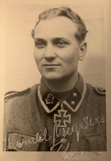
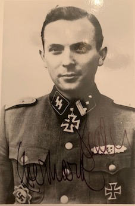

  
   

<b>Below is a selection of Waffen-SS Knight's Cross holder photographs currently for sale.</b>

 

Blond,	Friedrich: "LSSAH" Ausb. u. Ersatz Batt. 1:	PHOTO:	£25.00

Heder,	Eberhard: 5. SS-Panzer Division "Wiking":	PHOTO:	£25.00

Lainer,	Sepp: 2. SS-Panzer Div. "Das Reich":	PHOTO:	£25.00

Lichte,	Karl-Heinz: 5. SS-Panzer Division "Wiking":	PHOTO:	£25.00

Jürgens,	Heinz: 4. "SS-Polizei" Division:	PHOTO, LETTER:	£30.00

Nugiseks,	Harald: 20. SS-Division "Estnische Nr. 1":	PHOTO:	£25.00

Reber,	Gustav-Peter:	Kampfgruppe XI. SS-Panzer Korps:	PHOTO:	£25.00

Sametreiter,	Kurt:	1. SS-Panzer Division "LSSAH":	PHOTO (stamped signature):	£20.00

Schrijnen,	Remi:	27. SS-Division "Langemarck":	PHOTO: £25.00
 

<b><centre>Not see the person you would like to add to your collection in the list above? Just ask for who you seek, so that I can confirm whether they are within the wider collection.
