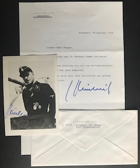

  
   

<b>Below is a selection of Waffen-SS Knight's Cross holder photographs currently for sale.</b>

 

Bachmann,	Erwin: 10. SS-Pz. Div. "Frundsberg":	PHOTO, ENVELOPE:	£30.00

Beßlein,	Georg-Robert:	Festung Breslau:	PHOTO, LETTER:	£25.00

Brosow,	Siegfried: 2. SS-Division "Das Reich":	PHOTO:	£25.00

Darges,	Fritz: 5. SS-Panzer Division "Wiking":	PHOTO:	£35.00

Gieseler,	Karl-Heinz:	11. SS-Pz.Gren.Div. "Nordland": LETTER (signed) and CV (signed):	£20.00

Jürgens,	Heinz: 4. SS-Polizei Division:	PHOTO, LETTER:	£30.00

Kam,	Sören: 5. SS-Panzer Division "Wiking":	PHOTO:	£25.00

Lichte,	Karl-Heinz:	5. SS-Panzer Division "Wiking":	PHOTO, LETTER, CV: £35.00

Nicolussi-Leck,	Karl:	5. SS-Panzer Divisions "Wiking": PHOTO, LETTER, ENVELOPE:	£25.00

Pitsch, Walter: 1. SS-Panzer Division "Leibstandarte SS-Adolf Hitler": PHOTO, LETTER: £30.00  

Reber,	Gustav-Peter:	Kampfgruppe XI. SS-Panzer Korps:	PHOTO:	£15.00

Riedel,	Franz:	10. SS-Panzer Div. "Frundsberg": PHOTO:	£25.00

Rieflin,	Fritz: 2. SS-Panzer Division "Das Reich":	PHOTO, ENVELOPE:	£30.00

Rudolf,	Richard: 12. SS-Panzer Div. "Hitlerjugend":	PHOTO:	£25.00

Scherg,	Johannes:	4. SS-Division "Polizei":	PHOTO:	£25.00

Schmidt,	Walter:	(Oakleaves): 5. SS-Panzer Division "Wiking":	PHOTO (colour):	£35.00

Schnaubelt,	Alois: 5. SS-Panzer Division "Wiking":	PHOTO:	£15.00

Schrijnen,	Remi:	27. SS-Division "Langemarck":	PHOTO: £25.00

Ullrich,	Karl:	(Oakleaves): 3. SS-Panzer Division "Totenkopf":	PHOTO, +1 copy PHOTO:	£35.00

Weidinger,	Otto:	(Swords): 2. SS-Panzer Division "Das Reich": PHOTO (clipped)		£20.00

Zeiher,	Robert:	SS Radolfzell:	PHOTO: £25.00

