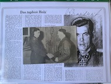

   

<b>Below is a selection of Waffen-SS Knight's Cross holder photographs currently for sale.</b>

 
 

<b>
Operation Barbarossa 1941 / 1942
</b>

Kumm,	Otto (KNIGHT'S CROSS):	SS-Division Reich:	PHOTO, SIGNED CARD: £70.00
 

<b>
Kharkov 1943
</b>

Kumm,	Otto:	(OAKLEAVES) SS-Division "Das Reich":	PHOTO, SIGNED CARD: £70.00
   

<b>
Russia 1943
</b>
    

Brosow,	Siegfried: 2. SS-Panzer Division "Das Reich":	PHOTO: £50.00  

Eichhorn,	Hugo:	SS-Division "Wiking":	PHOTO, LEBENSLAUF: £60.00

Goehler,	Johannes:	SS-Division "Florian Geyer":	PHOTO (large format): £50.00

Grieme,	Wilhelm:	SS-Division "Das Reich":	PHOTO, LEBENSLAUF: £60.00

Lainer,	Josef:	SS-Division "Das Reich":	PHOTO: £50.00

Mooymann,	Gerardes:	SS-Freiwilligen Legion  "Nederland":	PHOTO (Wartime clipped signature): £250.00

Muller,	Albert:	SS-Division "Wiking":	PHOTO: £55.00

Schneidereit,	Alfred:	1. SS-Panzer Division "LSSAH":	PHOTO, PRINT OUT: £50.00

Schulze,	Herbert: 2. SS-Panzer Division "Das Reich":	PHOTO: £50.00 

Zepper,	Erich:	5. SS-Panzer Division "Wiking":	PHOTO: £45.00 
    

<b>
Oranienbaum / Narwa / Tannenberg 1944
</b>
  

Langendorf,	Georg:	11. SS-Pz.Gren.Division "Nordland":	PHOTO, COPY RK SUBMISSION AND PRINT OUTS (6-PAGES): £60.00

Nugiseks,	Harald:	20. SS-Frei.Gren.Division "Estnische Nr. 1":	PHOTO: £45.00

Schrijnen,	Remi:	27. SS-Division "Langemarck":	PHOTO: £45.00
   

<b>
Tscherkassy Pocket 1944
</b>

Fischer,	Gerhard:	5. SS-Panzer Division "Wiking":	PHOTO, LEBENSLAUF, 2 X PRINT OUTS: £65.00 

Meyer,	Werner:	5. SS-Panzer Division "Wiking":	PHOTO: £50.00 
  

<b>
U.S.S.R. 1944
</b>
  

Traupe,	Hans:	4. SS-Division "Polizei":	PHOTO: £45.00  
  

<b>
'Normandy' 1944
</b>
  

Barkmann,	Ernst:	2. SS-Panzer Division "Das Reich": SIGNED NOTE: £35.00
     

<b>
'Market Garden' 1944
</b>
  

Euling,	Karl-Heinz:	10. SS-Panzer Division "Frundsberg":	PHOTO: £45.00
     

<b>
Poland 1944
</b>

Heder,	Eberhard:	5. SS-Panzer Division "Wiking":	PHOTO: £45.00 
   

<b>
Balkans / Romania / Hungary 1944 / 1945
</b>
 

Girg,	Walter (KNIGHT'S CROSS): SS-Jäger-Battalion 502:	SIGNED POSTCARD, SIGNED LETTER, LEBENSLAUF:	£45.00

Kumm,	Otto:	(SWORDS) 7. SS-Gebirgs Division "Prinz Eugen" (LATER DIVISIONAL COMMANDER):	PHOTO, SIGNED CARD: £70.00

Scherg,	Johannes:	4. SS-Division "Polizei":	PHOTO, LEBENSLAUF, PRINT OUT: £50.00
   

<b>
Colmar / Ardennes Offensive 1945
</b>
  

Sattler,	Karl:	SS-Regiment "Sattler":	PHOTO: £50.00
   

<b>
Kurland Pocket 1945
</b>
  

Behler,	Klemens:	23. SS-Division 'Nederland':	PHOTO: £50.00
   

<b>
Pomerania / Poland / Germany 1945
</b>
  

Egger,	Paul:	(s) SS-Panzer Abteilung 502:	PHOTO: £45.00

Girg,	Walter (OAKLEAVES): SS-Jäger-Battalion 502:	SIGNED POSTCARD, SIGNED LETTER, LEBENSLAUF:	£45.00

Hund,	Willi:	11. SS-Pz.Gren.Division "Nordland": PHOTO: £45.00 

Jürgens,	Heinz: 4. "SS-Polizei" Division:	PHOTO, 2-PAGE LEBENSLAUF:	£50.00

Langhorst,	Bernhard:	20. SS-Frei.Gren.Division "Estnische Nr. 1":	PHOTO: £55.00

Porsch,	Frithjof Elmo:	SS-Pz.Jg.Kp. Dora II: PHOTO: £45.00 
   

<b>
Slovenia 1945
</b>
  

Stenwedel,	Albert:	13. SS-Division "Handschar":	PHOTO (large format): £45.00
   

<b>
Budapest / Hungary / Austria 1945
</b>
  

Boosfeld,	Joachim:	8. SS-Division "Florian Geyer":	PHOTO: £45.00

Buck,	Friedrich:	8. SS-Division "Florian Geyer":	PHOTO, COPY LETTER: £50.00

Gustavsson,	Karl-Heinz:	2. SS-Division "Das Reich":	PHOTO: £45.00  

Hauser,	Hans:	2. SS-Division "Das Reich": PHOTO, SIGNED NOTE: £65.00 

Lichte,	Karl-Heinz:	5. SS-Panzer Division "Wiking":	PHOTO, LEBENSLAUF: £50.00

Rieflin,	Fritz:	2. SS-Division "Das Reich":	PHOTO, LEBENSLAUF: £50.00  

Sailer,	Johann:	9. SS-Division "Hohenstaufen":	PHOTO, LEBENSLAUF: £50.00
   

<b>
Fortress Breslau 1945
</b>
  

Besslein,	Georg-Robert:	9. SS-Division "Hohenstaufen":	PHOTO: £45.00  
   

<b>
Halbe Pocket 1945
</b>
  

Reber,	Gustav-Peter:	XI. SS-Panzer Korps:	PHOTO: £45.00

Richter,	Friedrich 'Fritz':	10. SS-Division "Frundsberg":	PHOTO: £50.00  
 

<b>
Battle for Berlin 1945
</b>
  

Fenet,	Henri:	33. SS-Frei.Gren.Division "Charlemagne":	SIGNED AND DATED CARD: £30.00

Gieseler,	Karl:	11. SS-Pz.Gren.Division "Nordland":	PHOTO, LEBENSLAUF: £50.00
 
    

<b><centre>Not see the person you would like to add to your collection in the list above? Just ask for who you seek, so that I can confirm whether they are within the wider collection.
