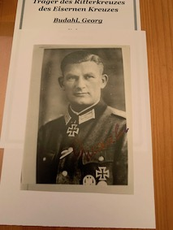

  
 

<b>Below is a selection of Heer Knight's Cross holder photographs currently for sale, focusing on  the Panzerjäger men.</b>

 

Adrario,	Friedrich:	Panzerjäger Abteilung 272:	PHOTO, WRITTEN CARD, ENVELOPE:	£25.00

Anding,	Friedrich:	Grossdeutschland Pz.Jg. Abt:	PHOTO:	£25.00

Angel,	Otto:	Panzerjäger Abteilung 6:	PHOTO, LETTER:	£20.00

Barall,	Benno: Pz. Jg. Abteilung 227:	PHOTO:	£15.00

Barth,	Joachim: Panzerjäger Abteilung 13:	PHOTO, LETTER:	£20.00

Beck-Broichsitter,	Helmut: Grossdeutschland Pz.Jg. Kp.:	PHOTO, LETTER:	£20.00

Behnke,	Heinz: Panzerjäger Kp. Gren. Rgt. 668:	PHOTO, LETTER, CV, Copy RK prelim doc:	£30.00

Beier,	Gerhard: Panzerjäger Kompanie 1193:	PHOTO, LETTER:	£20.00

Budahl,	Georg: Panzerjäger Abteilung 121:	PHOTO:	£15.00

Düe,	Rolf: Panzerjäger Abteilung 19:	PHOTO, LETTER:	£20.00

Fasel,	Walter: 14. (Panzerjäger-)Kp./ Füs.-Rgt 26:	PHOTO:	£15.00

Fischer,	Robert: Jägdpanzer Kompanie 1257:	PHOTO, LETTER:	£20.00

Glaser,	Friedrich: 14. Panzerjäger Kp. Gren.Rgt. 253:	PHOTO, ENVELOPE:	£20.00

Glatz,	Josef: Panzerjäger Abteilung 46:	PHOTO, LETTER, ENVELOPE:	£25.00

Gutheit,	Helmut: Jagdpanzer Kompanie 1011:	PHOTO (clipped), LETTER:		£15.00

Haase,	Horst: Panzerjäger Kompanie 1162:	PHOTO, LETTER:	£20.00

Hartmann,	Leo: Panzerjäger Abteilung Breslau:	PHOTO:	£15.00

Holz,	Günther: Panzerjäger Abteilung 258:	PHOTO, LETTER, ENVELOPE, CV x 3:	£30.00

Hümmerich,	Willi: 14. Panzerjäger Kp. (Inf. Rgt. 80):	PHOTO, LETTER / CV, ENVELOPE:	£25.00

Jakwert,	Josef	(OAKLEAVES): Division Panzerjäger Kp. 361:	PHOTO, ENVELOPE:	£25.00

Koch,	Dr. rer. Pol. Dietrich: Panzerjäger Abteilung 88:	PHOTO, LETTER, ENVELOPE:	£25.00

Kox,	Peter: Panzerjäger Abteilung 169:	PHOTO, LETTER, ENVELOPE, copy PHOTO:	£25.00

Ksiag,	Hans: Panzerjäger Abteilung 176:	PHOTO, ENVELOPE, PRINT OUT:	£25.00

Kuhnert,	Manfred: 14. Pzjäger Kp. (Gren. Rgt. 442):	PHOTO:	£15.00

Kurze,	Max: Panzerjäger Abteilung 187:	PHOTO, LETTER, ENVELOPE:	£25.00

Müller,	Walter: Panzerjäger Abteilung 389:	PHOTO, LETTER:	£20.00

Musculus,	Friedrich-Heinrich: Panzerjäger Abteilung 111:	PHOTO, NOTE, ADDRESS LABEL:	£25.00

Neigl,	Ludwig: Panzerjäger Abteilung 519:	PHOTO, LETTER, ENVELOPE:	£25.00

Niemietz,	Josef: Panzerjäger Abteilung 332:	PHOTO, LETTER, ENVELOPE:	£25.00

Noak,	Karl-Heinz	(OAKLEAVES):	Panzerjäger Abteilung 46:	PHOTO (clipped):	£10.00

Planitz, von der	Max Edler: Panzerjäger Abteilung 161:	PHOTO, LETTER, ENVELOPE:	£25.00

Radowski,	Eduard: Panzerjäger Abteilung 53:	PHOTO, 2 SIGNED NOTES:	£20.00

Rehm,	Erich: Panzerjäger Kompanie 1156:	PHOTO, LETTER, CV ( 3 double sided page):	£25.00

Rehnitz,	Konrad: Panzerjäger Abteilung 27:	PHOTO, LETTER, ADDRESS LABEL:	£25.00

Reuter,	Erich: (schwere) Panzerjäger Abt. 519:	PHOTO, LETTER, ENVELOPE, PRINT OUT:	£30.00

Schacht,	Heinz: Panzerjäger Abteilung 158:	PHOTO:	£15.00

Scheibig,	Erich: Panzerjäger Kp. (Gren. Rgt. 174):	PHOTO:	£15.00

Schmalz,	Eberhard: Panzerjäger Kompanie 1102:	PHOTO:	£15.00

Siebert,	Franz: Panzerjäger Abteilung 306:	PHOTO:	£15.00

Straube,	Georg:	Panzerjäger Abteilung 18:	PHOTO, PRINT OUT:	£20.00

Weyel,	Erich: Panzerjäger, Inf. Rgt. 506:	PHOTO, LETTER, CV, ENVELOPE:	£25.00

Wilke,	Giselher: Panzerjäger Abteilung 19:	PHOTO, CV, ENVELOPE:	£25.00

Windschüttl,	Peter: 14. (Panzerjäger) /Gren. Reg. 7:	PHOTO, LETTER, ENVELOPE, PRINT OUT:	£30.00

Zahn,	Dr. rer. Pol. Eberhard	(OAKLEAVES):	Panzerjäger Abt. 33 (D.A.K.):	PHOTO:	£20.00

Zenker,	Franz: Panzerjaeger Abteilung 12:	PHOTO, copy PHOTO:	£15.00

Zoll,	Erhard: Panzerjäger, Gren. Rgt. 436:	PHOTO:	£15.00

 

<b>
Not see the person you would like to add to your collection in the list above? Just ask for who you seek, so that I can confirm whether they are within the wider collection.
</b>

