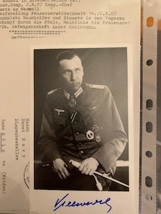
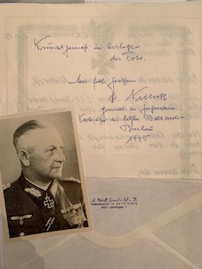
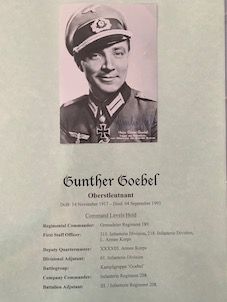

  
 

<b>Below is a selection of Heer Knight's Cross holder photographs currently for sale, focusing on  the Infanterie.</b>

 

Abel, Josef:	Infantry Regiment 217:	PHOTO: £15.00

Arndt,	Karl	(OAKLEAVES):	Infantry Regiment 511:	PHOTO:	£20.00

Baumgarten-Crusius,	Werner	(OAKLEAVES):	Infantry Regiment 156 (mot.):	PHOTO: £20.00

Behrend,	Hermann-Heinrich	(SWORDS & OAKLEAVES):	Infantry Regiment 489:	PHOTO, LETTER, ENVELOPE:	General Major 490. ID:	£45.00

Biehl,	Johann: Infantry Regiment 124:	PHOTO, SIGNED PAPER ITEM:	£20.00

Boje,	Arthur: Infanterie Regiment 134	PHOTO, NOTE, ENVELOPE:	£25.00

Bredemeyer,	Franz: Infanterie Regiment 156 (mot.):	PHOTO:	£15.00

Britzelmayr,	Karl: Infanterie Regiment 271	PHOTO, LETTER, 2 x NOTES, ENVELOPE:	£30.00

Bruns,	Diedrich: Infanterie Regiment 16	PHOTO, ENVELOPE:	Sevastopol:	£20.00

Cipa,	Oskar: Infantry Regiment 305	PHOTO, NOTE, ENVELOPE:	£25.00

 
Conrady,	Alexander	(OAKLEAVES): 36. Infanterie Division:	PHOTO:	General Major, 36. ID:	£30.00

Dörfel,	Josef: Infantry Regiment 439:	PHOTO, 3 COPY AWARD DOCS:	£20.00

Dorow,	Otto: Infanterie Regiment 514:	PHOTO:	£15.00

Eßbach,	Gotthard: Infantry Regiment 31:	PHOTO:	£15.00

Ewert,	Wolf: 338. Infanterie Division:	PHOTO, ENVELOPE:	General Major, 338. ID:	£30.00

Faasch,	Hans: Infantry Regiment 164:	PHOTO:	£15.00

Flörke,	Hermann	(OAKLEAVES):	14. Infanterie Division:	PHOTO, MEMORIAL BOOKLET:	Generalleutnant, 14. ID:	£35.00

Gidion,	Dr. phil. Hans: Infanterie Regiment 154:	PHOTO, LETTER, ENVELOPE:	£25.00

Göbel,	Günter	(OAKLEAVES):	Infanterie Regiment 208:	PHOTO, LETTER:	£25.00

Gollas,	Josef: Infanterie Regiment 106	PHOTO, LETTER, ENVELOPE:	£25.00

Griesbach,	Franz	(SWORDS & OAKLEAVES):	170. Infanterie Division Commander:	PHOTO:	General Major:	£35.00

Haarhaus,	Walter: Infanterie Regiment 477:	PHOTO:	£15.00

Haß,	Siegfried: 170. Infanterie Division	PHOTO, LETTER:	Generalleutnant, 170. ID:	£30.00

Hein,	Gerhard	(OAKLEAVES): Infanterie Regiment 220:	PHOTO, LETTER, ENVELOPE: £30.00

Hohn,	Hermann	(SWORDS & OAKLEAVES):	72. Infanterie Division:	PHOTO:	Generalleutnant: £35.00

Hopf,	Theodor: Infanterie Regiment 170:	PHOTO, LETTER, ENVELOPE:	£25.00

Ingram,	Hermann, Ritter von: Infanterie-Regiment 309:	PHOTOCOPY PHOTO SIGNED:	£10.00

Jakob,	Friedrich	(OAKLEAVES):	Infanterie Regiment 105:	PHOTO, LETTER:	£25.00

Jordan,	Hans: 72. Infanterie Division (Ia):	PHOTO:	£15.00

Jüttner,	Arthur	(SWORDS & OAKLEAVES):	Inf. Rgt. 38, Gren. Rgt. 532, Gren. Rgt. 164:	PHOTO, LETTER, ENVELOPE:	£35.00

Jungkunst,	Johann: Infanterie Regiment 41:	PHOTO, PRINT OUT, ENVELOPE:	£25.00

Ketterl,	Franz: Infanterie Regiment 438:	PHOTO:	£15.00

König,	Ernst	(OAKLEAVES): 31. Infanterie Division:	PHOTO, LETTER:	"General Major, 31. ID, 20. "JD":	£35.00

Kohler,	Wilhelm	(OAKLEAVES): Infanterie Regiment 195:	PHOTO, LETTER, 11 PAGE PRINT OUT:	£35.00

Krosigk, von	Dedo: Infanterie Regiment 51:	PHOTO, LETTER, ENVELOPE, CV (signed):	£30.00

Kulot,	Josef: Infanterie Regiment 60:	PHOTO:	£15.00

Kuzmany,	Alfred: Infanterie Regiment 338:	PHOTO:	£15.00

Kylling-Schmidt,	Ekkehard	(OAKLEAVES): Infanterie Regiment 26: PHOTO:	£20.00

Leukefeld,	Karl-Otto: Infanterie Regiment 123:	PHOTO, LETTER:	£20.00

Lindner,	Gerhard: 346. Infanterie Division C.O.:	PHOTO, LETTER, ENVELOPE:	General Major:	£35.00

Loth,	Hans: Infanterie Regiment 203:	PHOTO, ENVELOPE:	£20.00

Lücken, von	Theodor	(OAKLEAVES): Infanterie Regiment 502:	PHOTO, LETTER, ENVELOPE, 2 x print out:	£35.00

Merten,	Peter: Infanterie Regiment 124: PHOTO:	£15.00

Mokros,	Gerhard	(OAKLEAVES):	Infanterie Regiment 331:	PHOTO:	£20.00

Niehoff,	Hermann	(SWORDS & OAKLEAVES):	371. Infanterie Division:	PHOTO (clipped), LETTER, ENVELOPE: General der Infanterie, Breslau CO: £40.00

Pankow,	Dr. med. dent. Werner: Infanterie Regiment 151: PHOTO, ENVELOPE:	£20.00

Pestke,	Hans-Gotthard	(OAKLEAVES): Infanterie Regiment 176:	PHOTO, LETTER, ENVELOPE:	£30.00

Pick,	Gerhard	(OAKLEAVES): Infanterie Regiment 490: PHOTO	(colour), LETTER, UNSIGNED PHOTO:	£30.00

Pohl,	Eberhard: Infanterie Regiment 134: PHOTO: £15.00

Pongratz,	Johann: Infanterie Regiment 74:	PHOTO, LETTER:	£20.00

Port, Johann: Infanterie Regiment 266:	PHOTO:	£15.00

Ranck,	Werner: 121. Infanterie Division:	PHOTO, LETTER, ENVELOPE, PRINT OUT:	Genealleutnant. 121., 228. ID: £40.00

Richter,	Emil: Infanterie Regiment 401: PHOTO, EMVELOPE:	£20.00

Rodenburg,	Carl	(OAKLEAVES): 76. Infanterie Division:	PHOTO, 2 LETTERS:	Generalmajor, 76. ID, surrender at Stalingrad:	£40.00

Roßfeld,	Christian: Infanterie Regiment 62: PHOTO, ENVELOPE, SIGNED PRINT OUT:	£25.00

Schimmel,	Hugo: Infanterie Regiment 41 (mot.):	PHOTO, SIGNED ADDRESS LABEL:	£20.00

Schmahl,	Adolf: Infanterie Regiment 6:	PHOTO, LETTER:	£20.00

Schulz,	Johannes: Infanterie Regiment 49:	PHOTO, LETTER, ENVELOPE:	£25.00

Schuss,	Joseph: Infanterie Regiment 520:	PHOTO, LETTER, ENVELOPE:	£25.00

Seidel,	Dr. jur. Heinrich: Infanterie Regiment 422: PHOTO, CV, ENVELOPE:	£25.00

Steinke,	Erhard: 129. Infanterie Division:	PHOTO, LETTER, ENVELOPE:	£25.00

Sturm,	Hans: Infanterie Reg. 473., 253. Inf. Div.:	PHOTO, CV, NOTE:	£25.00

Sulzer,	Rudolf: Inf. Rgt. 161:	PHOTO, 2 x CV: £20.00

Thomas,	Wilhelm: Infanterie Regiment 71 C.O.: LETTER ONLY:	£10.00

Veeser,	Peter: Infanterie Regiment 125: PHOTO, ENVELOPE:	£20.00

Vernhold,	Josef: Infantry Regiment 60: PHOTO, LETTER:	£20.00

Vielwerth,	Erich: Infanterie Regiment 87: PHOTO, CV, ENVELOPE:	£25.00

Wilde,	Heinz: 353. Infanterie Division:	PHOTO, LETTER:	£20.00

Wolfram,	Eberhard: Infanterie Regiment 82: PHOTO:	£15.00

 

<b>
Not see the person you would like to add to your collection in the list above? Just ask for who you seek, so that I can confirm whether they are within the wider collection.
</b>

