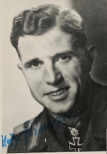
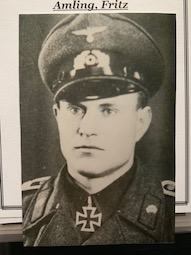

  
 

<b>Below is a selection of Heer Knight's Cross holder photographs currently for sale, focusing on: Top scoring Panzer / Armour Aces.</b>

 

<b>
'Panzer Aces'
</b>

Sandrock,	Hans: Fallschirmjäger Pz. Rgt. "HG":	(123 kills): PHOTO, ENVELOPE, NOTE:	£25.00

Fischer,	Gerhard: Panzer Regiment 23:	(102 kills): PHOTO, LETTER:	£20.00

Kerscher,	Albert:	(schwere) Panzer Abteilung 502:	(100+ kills): PHOTO:	£15.00

Bix,	Hermann: Panzer Regiment 35: (100 kills): PHOTO: £15.00

Eckardt,	Hermann: Panzer Abteilung 8:	(78 Kills): PHOTO, LETTER, CV:	£25.00

Spranz,	Bodo:	(OAKLEAVES): Sturmgeschütz Brigade 237:	(76 kills): PHOTO (colour):	£25.00

Primozic,	Hugo:	(OAKLEAVES): Sturmgeschütz Brigade 667:	(68+ kills): PHOTO, LETTER:	£25.00

Brandner,	Josef:	(OAKLEAVES): Heeres Strmartillerie Brig. 912:	(66 kills): PHOTO, ENVELOPE, 1 x COPY AWARD DOC, 1 PRINT OUT, POSTCARD:	£40.00

Witte,	Albert: Sturmgeschütz Abteilung 394: (56 kills): PHOTO, LETTER: £20.00

Sametreiter,	Kurt:	LSSAH	(stamped signature):	(56 kills):	PHOTO: £20.00

Rohrbacher,	Josef: Sturmgeschütz Brigade 245:	(56 kills): PHOTO:	£15.00

Arnold,	Friedrich: Sturmgeschütz Brigade 237:	(51 kills): PHOTO:	£15.00

Adamowitsch,	Felix: Sturmgeschütz Brigade 309:	(50 kills): PHOTO, LETTER, ENVELOPE:	£25.00

Kahl,	Bruno: (OAKLEAVES): Panzer Regiment 21:	(50 kills): PHOTO, 1 COPY AWARD DOC:	£25.00

Spielmann,	Johann:	(OAKLEAVES): Sturmgeschütz Abteilung 197:	(49 kills): PHOTO, ENVELOPE, signed CV:	£30.00

Bostell, von	Wolfgang:	(OAKLEAVES): Sturmgeschütz Kompanie 1023:	(49 kills): PHOTO, LETTER, CV, 5-PAGE PRINT OUT:	£35.00

Zillmann,	Erich: Sturmgeschütz Brigade 245:	(48 kills): PHOTO, unsigned PHOTO and LETTER from wife:	£25.00

Ahrend,	Hoper: Sturmgeschütz Abt. 202:	(47 kills): PHOTO, ENVELOPE:	£20.00

Weißflog,	Hans-Joachim:	Panzer Regiment 16:	(47+ kills): PHOTO:	£15.00

Deutsch,	Heinz: Fallschirmjäger Stug. Brig. 12:	(46 kills): PHOTO, LETTER:	£20.00

Bose,	Georg: Sturmgeschütz Abteilung 177:	(44 kills): PHOTO:	£15.00

Amling,	Fritz: Sturmgeschütz Abt. 202:	(42 kills): PHOTO (clipped):	£15.00

Scharf,	Heinz: Sturmgeschütz Brigade 202:	(40+ kills): PHOTO, PRINT OUT:	£20.00

Tornau,	Gottfried: Sturmartillerie Brigade "GD": (40 kills): PHOTO, LETTER, signed CV: £25.00

 

<b>
Not see the person you would like to add to your collection in the list above? Just ask for who you seek, so that I can confirm whether they are within the wider collection.
</b>

