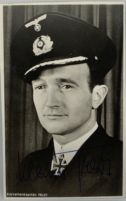

  
 

<b>Below is a selection of Kriegsmarine Knight's Cross holder photographs currently for sale, this batch focusing on the S-Boat and other surface fleet naval-men.</b> 

Bastian,	Helmut: Sprengboot Flotilla Kdr.:	PHOTO, LETTER: £20.00

Birnbacher,	Heinz: 1. Schnellbootsflottille Chief:	PHOTO, LETTER, ENVELOPE, COPY PHOTO: £30.00

Bögel,	Hermann: M4040 (40. MS Flotille):	PHOTO (CLIPPED): £15.00

Bramesfeld, Heinrich: 2. Sicherungs Division:	PHOTO, LETTER: £20.00

Büchting,	Hermann: Schnellboot (S-27):	SIGNED CARD ONLY: £10.00

Feldt,	Klaus (Oakleaves): Schnellboot (S-43, 2. Schn. Flott.):	PHOTO: £20.00

Feldt,	Kurt: Schnellboot (S-43, 2. Schn. Flott.):	PHOTO:	£15.00

Fimmen,	Kurt: Schnellboots Flotille 1:	PHOTO, LETTER, PRINT OUT: £25.00

Gartzen, von,	Wirich: 10. Torpeedobootsflottille:	PHOTO, LETTER, ENVELOPE, PRINT OUT: £30.00

Kemnade,	Friedrich (Oakleaves): 3. Schnellboots Flotille:	PHOTO, LETTER, DEATH NOTICE: £30.00

Künzel,	Karl-Friedrich: Schnellboot (S-28):	PHOTO: £15.00

Martienssen,	Ekkehard: "Vp. 203" Vorpostenflottille:	PHOTO: £15.00

Müller,	Albert: Schnellboot (S-59):	PHOTO: £15.00

Muser,	Alfred: 8. Raumboots-flottille Commander: PHOTO, LETTER: £20.00

Paul,	Karl: 2. Torpedoboots Flottille C.O.:	PHOTO, NOTE: £20.00

Rehm,	Hans: 2. Minensuchflottille C.O.:	PHOTO, 2 LETTERS, ENVELOPET: £25.00

Ruge,	Friedrich: GENERALLEUTNANT Commodore, Minensuchboote West:	PHOTO, LETTER: £40.00

Schneider,	Gerd-Dietrich: 8 Artillerie träger flottille):	PHOTO: £15.00

Schulz,	Karl: "VP 1509":	PHOTO, LETTER, ENVELOPE, CV: £30.00

Wagner,	Gerhard: KONTEADMIRAL Present at the Luneberg Heath surrender with Montgomery (NON-RK HOLDER):	PHOTO, LETTER: £25.00

Weber,	Horst: Schnellboot (S-55):	SIGNED PRINT: £15.00

Weyher,	Kurt: KONTEADMIRAL Hilfskreuzer "Orion":	PHOTO: £35.00

Witt,	Hermann: KONTEADMIRAL Hafenkommandant Cherbourg:	PHOTO, LETTER, CV: £45.00

Wuppermann,	Siegfried (Oakleaves): Schnellboot (S-60):	PHOTO, LETTER, PRINT OUT, COPY PHOTO: £30.00

Zymalkowski,	Felix: 8. Schnellbootsflottille Chief:	PHOTO, ADDRESS CARD (signed): £20.00

 

<b><centre>Not see the person you would like to add to your collection in the list above? Just ask for who you seek, so that I can confirm whether they are within the wider collection.
