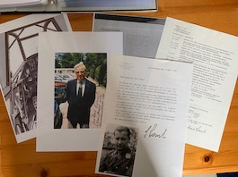

  

  
 

<b>Below is a selection of Luftwaffe Knight's Cross holder photographs currently for sale, this batch focusing on the Nacht Jagd Geschwader (Night Figther) pilots.</b>

Bahr,	Günther: NJG6:	PHOTO, LETTER, KILL LIST:	£25.00

Becker,	Martin	(Oakleaves): NJG6:	PHOTO: £20.00

Döring,	Arnold: NJG3:	PHOTO, LETTER, ENVELOPE: £25.00

Drewes,	Martin:	(Oakleaves): NJG1:	PHOTO, LETTER, PRINT OUT:	£30.00

Eberspächer,	Helmut: Nachtschlacht-Gruppe 20:	PHOTO, LETTER: £20.00

Falck,	Wolfgang: NJG1:	PHOTO, LETTER, ENVELOPE, SIGNED PRINT OUT: £30.00

Flögel,	Josef: Nachtschlacht-Geschwader 5:	PHOTO, ENVELOPE:	£20.00

Frost,	Rupert: Nacht-Schlacht-Gruppe 9: PHOTO (clipped): £10.00

Greiner,	Hermann: NJG1:	PHOTO, LETTER: £20.00

Hoffmann,	Werner: NJG5: PHOTO, PRINT OUT:	£20.00

Johanssen,	Karl-Ludwig: NJG6:	PHOTO: £15.00

Johnen,	Wilhelm: NJG6:	PHOTO, PRINT OUT:	£20.00

Meister,	Ludwig:	NJG4:	PHOTO: £15.00

Rauh,	Paul-Hubert: NJG4:	COLOUR PHOTO, LETTER, CV, 2 PRINT OUTS, 2 PW COLOUR: £40.00

Rökker,	Heinz	(Oakleaves): NJG2:	PHOTO, LETTER, PRINT OUT:	£30.00

Rumpelhardt,	Friedrich: NJG1:	PHOTO, PRINT OUT:	£20.00

Schmidt,	Dietrich: NJG1:	PHOTO: £15.00

Schönert,	Rudolf	(Oakleaves): NJG2:	PHOTO: £20.00

Zorner,	Paul	(Oakleaves): NJG3: PHOTO, PRINT OUT: £25.00

<b><centre>Not see the person you would like to add to your collection in the list above? Just ask for who you seek, so that I can confirm whether they are within the wider collection.

