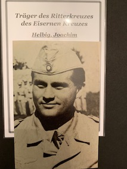

  

  
 

<b>Below is a selection of Luftwaffe Knight's Cross holder photographs currently for sale, focusing on those who served in Flak units, LG, TG and ZG formations, as well as a few oddities.</b>

Beerenbrock,	Franz Josef	(OAKLEAVES): JG51 "Mölders":	PHOTO, PHOTO unsigned:	110+ victories:	£25.00

Bartels,	Herbert: Flak. Regiment 293 (mot.):	PHOTO, LETTER: £20.00

Berner,	Emil:	Flak Regiment 18 (D.A.K.):	PHOTO, PRINT OUT:	£15.00

Blasig,	Arnulf:	LG1	PHOTO:	£15.00

Böcker,	Heinrich: LG1	PHOTO:	£15.00

Bonath,	Hans: Wettererkundungsstaffel 27:	PHOTO:	£15.00

Bonnke,	Friedrich: Flak Regiment 42 (mot.):	PHOTO, ENVELOPE:	£20.00

Bürger,	Albert:	4. Flak Division:	3 x post war PHOTOS, 1 CV:	£20.00

Bulmahn,	Karl: 559. Volks-Grenadier-Division:	PHOTO, LETTER, CV:	£25.00

Christl,	Georg: ZG26 "Horst Wessel", (D.A.K.):	PHOTO:	£15.00

Cleve,	Rudolf: Flak Regiment 4 (mot.):	PHOTO, LETTER, PRINT OUT:	£25.00

Corts,	Helmut: Flak Regiment 64 (mot.):	PHOTO, LETTER:	£20.00

Cramer,	Heinz: LG1:	PHOTO, LETTER, ENVELOPE, PRINT OUT:	£30.00

Eggers,	Hermann: Flak Regiment 64:	PHOTO, LETTER:	£20.00

Fahlbusch,	Wilhelm: Flak Regiment 11 (mot.):	PHOTO, LETTER:	£20.00

Fischer,	Michael: Flak Regiment 14 (mot.):	PHOTO:	£15.00

Fröbel,	Hans-Roland: Flak Kampfgruppe 287:	PHOTO, LETTER:	£20.00

Gemünden,	Otto: Flak Regiment 49:	PHOTO, LETTER, CV, ENVELOPE, PRINT OUT:	£35.00

Haugk,	Helmut: ZG26 "Horst Wessel":	PHOTO:	£15.00

Heintze,	Erich: Flak Regiment 33 (mot.) (D.A.K.):	PHOTO:	£15.00

Helbig,	Joachim	(SWORDS): LG1:	PHOTO (clipped):	£20.00

Hogeback,	Hermann	(SWORDS): LG1 (D.A.K.), KG6:	PHOTO (colour):	£30.00

Hundertmark,	Gerhard:	gem. Flak Sturm Abt. 802 (v.):	PHOTO, LETTER, ENVELOPE, 11-page PRINT OUT:	£35.00

Isachsen,	Herbert: LG1 (D.A.K.): PHOTO:	£15.00

Jabs,	Hans-Joachim	(OAKLEAVES): ZG76:	PHOTO:	£20.00

Junge,	Herbert: (schwere) Flak Abteilung 326:	PHOTO:	£15.00

Krebs,	Erich: Flak Regiment 11:	PHOTO:	£15.00

Lüdke,	Ernst: gem. Flak Abteilung 241:	PHOTO, LETTER, ENVELOPE:	£25.00

Messer,	Wilhelm: TG2:	PHOTO: £15.00

Pfeiffer,	Johannes: LG1:	PHOTO (clipped):	£10.00

Pirhofer,	Ernst: Flak Regiment 43 (mot.):	PHOTO, PRINT OUT:	£20.00

Prentl,	Josef	(OAKLEAVES): Flak Regiment 29:	PHOTO, SIGNED ADDRESS CARD:	£25.00

Richter,	Gerhard: LG1:	PHOTO, ENVELOPE:	£20.00

Rötche,	Hans: Transport Geschwader 1:	Colour PHOTO:	£20.00

Roth,	Günther: LG1:	PHOTO:	£15.00

Schlund,	Franz: LG1:	PHOTO, LETTER, ENVELOPE:	£25.00

Schneider,	Herbert: Flak Regiment 48 (mot.):	PHOTO:	£15.00

Schulze,	Franz-Joseph: Flak Sturm Regiment 241:	PHOTO:	£15.00

Schwabach,	Theo: Flak Regiment 33 (D.A.K.):	PHOTO (clipped):	£10.00

Stamp,	Gerhard: LG1:	PHOTO:	£15.00

Vesenmayer,	Dr. agrar. Hans: Flak Abteilung 77 (mot.):	PHOTO, LETTER:	£20.00

Zebhauser,	Paul: TG1:	PHOTO (clipped):	£10.00

<b><centre>Not see the person you would like to add to your collection in the list above? Just ask for who you seek, so that I can confirm whether they are within the wider collection.
