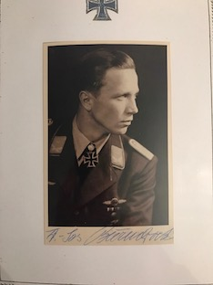

  

  
 

<b>Below is a selection of Luftwaffe Knight's Cross holder photographs currently for sale, this batch focusing on the Jagd Geschwader pilots.</b>

Beerenbrock,	Franz-Josef	(Oakleaves): JG51 "Mölders":	PHOTO, PHOTO (UNSIGNED): £25.00

Bendert,	Karl-Heinz: JG27 (D.A.K.):	PHOTO: £15.00

  
Bennemann,	Dr. med. dent. Helmut: JG52: PHOTO: £15.00

Bob,	Hans-Ekkehard: JG54:	PHOTO, SIGNED PRINT OUT: £20.00

Börngen,	Ernst: JG27:	PHOTO: £15.00

Broch,	Hugo: JG54:	PHOTO, LETTER: £20.00

Broch,	Hugo: JG54:	PHOTO (SIGNED BY HERMANN SCHLEINHEGE TOO): £35.00

Crinius,	Wilhelm	(Oakleaves): JG53, (D.A.K.):	PHOTO: £20.00

Dahl,	Walther	(Oakleaves): JG3 "Udet":	PHOTO:	£20.00

Dahmer,	Hugo: JG5:	PHOTO, LETTER, SIGNED PRINT: £25.00

Dickfeld, Adolf	(Oakleaves): JG52:	PHOTO, ENVELOPE, PRINT OUT: £30.00

Düttmann,	Peter: JG52:	PHOTO: £15.00

Eder,	Georg-Peter	(Oakleaves): JG1:	PHOTO: £20.00

Eisenach,	Franz-Josef: JG54:	PHOTO: £15.00

Ewald,	Heinz: JG52:	PHOTO, LETTER, PRINT OUT:	£25.00

Glunz,	Adolf	(Oakleaves): JG26 "Schlageter":	PHOTO: £20.00

Grislawski,	Alfred	(Oakleaves): JG52:	PHOTO, 1 SIGNED MEDAL GROUPING PHOTO:	£30.00

Hermichen,	Rolf	(Oakleaves): JG11:	PHOTO: £20.00

Huy,	Wolf-Dietrich	(Oakleaves): JG77:	PHOTO, 2 COPY PHOTOS: £25.000

Isken,	Eduard: JG53:	PHOTO, PRINT OUT:	£20.00

Josten,	Günther	(Oakleaves): JG51: "Mölders":	PHOTO: £20.00

Kaiser,	Herbert: JG77:	PHOTO, LETTER: £20.00

Karch,	Fritz: JG2 "Richthofen":	LETTER ONLY:	£10.00

Köhler,	Armin: JG77:	LETTER ONLY:	£10.00

Litjens,	Stefan: JG53:	PHOTO: £15.00

Loos,	Walter: JG300:	PHOTO: £15.00

Marquardt,	Heinz: JG51 "Mölders":	PHOTO: £15.00

Mayerl,	Maximilian: JG51 "Mölders":	PHOTO: £15.00

Naumann,	Johannes: JG6:	PHOTO: £15.00

Petermann,	Viktor: JG52: 	PHOTO: £15.00

Pichler,	Johann: JG77:	PHOTO, LETTER: £20.00

Pingel,	Rolf: JG26 "Schlageter":	PHOTO: £15.00

Rall,	Günther	(Swords): JG52:	PHOTO, PRINT OUT:	£30.00

Rammelt,	Karl: JG51 "Mölders":	PHOTO: £15.00

Reinert,	Ernst-Wilhelm	(Swords): JG77 (D.A.K.):	COLOUR PHOTO:	£30.00

Rödel,	Gustav-Siegfried	(Oakleaves): JG27 (D.A.K.):	PHOTO: £20.00

Roßmann,	Edmund: JG52:	PHOTO, LETTER: £20.00

Rüffler,	Helmut: JG3 "Udet":	PHOTO, LETTER, ENVELOPE: £25.00

Schack,	Günther	(Oakleaves): JG51 "Mölders":	COLOUR PHOTO:	£25.00

Schleinhege,	Hermann: JG54: LETTER ONLY:	£10.00

Schmidt,	Winfrid: JG3:	PHOTO: £15.00

Schönfelder,	Helmut: JG51 "Mölders":	PHOTO: £15.00

Schöpfel,	Gerhard: JG26 "Schlageter":	PHOTO, PRINT OUT:	£20.00

Schuck,	Walter	(Oakleaves): JG5:	PHOTO, LETTER:	£25.00

Seeger,	Günther: JG53: PHOTO, LETTER, ENVELOPE:	£25.00

Späte,	Wolfgang	(Oakleaves): JG54: PHOTO: £20.00

Steinhoff,	Johannes	(Swords): JG52: LETTER, PRINT OUT X 2: £20.00

Stolle,	Bruno: JG2 "Richthofen":	PHOTO: £15.00

Tegtmeier,	Fritz: JG54:	PHOTO: £15.00

Thyben,	Gerhard	(Oakleaves): JG54:	PHOTO: £20.00

Trenkel,	Rudolf: JG52:	PHOTO (CLIPPED), LETTER:	£20.00

Unger,	Willy: JG3 "Udet": LETTER ONLY:	£10.00

Weik,	Hans: JG3 "Udet":	PHOTO, LETTER:	£20.00

Woidich,	Franz: JG52:	PHOTO: £15.00

Wolfrum,	Walter: JG52:	PHOTO: £15.00

<b><centre>Not see the person you would like to add to your collection in the list above? Just ask for who you seek, so that I can confirm whether they are within the wider collection.

