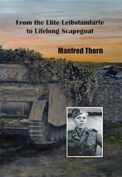

<b>Below is a selection of Fallschirmjäger Knight's Cross holder photographs currently for sale.</b>

 

Becker,	Karl-Heinz	(Oakleaves): Fallschirmjäger Regiment 1:	Photo: £30.00

Beine,	Erich: Fallschirmjäger Regiment 12:	Photo, letter, print out:	£35.00

Blauensteiner,	Ernst: Ia, II. Fallschirmjäger Korps:	Photo: £25.00

Büttner,	Manfred: Fallschirmjäger Regiment 26: Photo, letter, envelope: £35.00

Conrath,	Paul (Swords): Inspector der Fallschirmjäger / General der Fallschirmjaeger: Photo:	£50.00

Delica,	Egon: Fallschirmjäger Sturm Abteiung "Koch":	Photo: £45.00

Deutsch,	Heinz: Fallschirmjäger Stug. Brig. 12:	Photo, letter: £35.00

Donth,	Rudolf:	Fallschirmjäger Regiment 4:	Photo: £30.00

Ewald,	Werner:	Fallschirmjäger Regiment 2: Letter only:	£10.00

Genz,	Alfred:	Fallschirmjäger Sturm Rgt. 1: Photo: £25.00

Gericke,	Walter (Oakleaves): Fallschirmjäger Regiment 1:	Photo: £35.00

Germer,	Ernst: Fallschirmjäger Regiment 1:	Photo: £25.00

Gerstner,	Siegfried: Fallschirmjäger Regiment 1:	Photo, address card: £30.00

Gröschke,	Kurt	(Oakleaves): Fallschirmjäger Regiment 1:	Photo: £30.00

Herrmann,	Harry: Fallschirmjäger Regiment 1:	Photo: £35.00

Hübner,	Eduard:	1. Fallschirmjäger Armee:	Photo (clipped): £20.00

Jamrowski,	Siegfried: Fallschirmjäger Regiment 3:	Photo, letter: £30.00

Kroymanns,	Willy: Fallschirmjäger Regiment 12:	Photo, letter: £30.00

Kühne,	Martin: Fallschirmjäger Regiment 2:	Photo: £25.00

Liebing,	Walter:	Fallschirmjäger "KG Eggers":	Photo, envelope: £30.00

Meyer,	Heinz	(Oakleaves): Fallschirmjäger Regiment 4:	Photo (clipped / ripped): £25.00

Milch,	Dr. jur. Werner: Fallschirmjäger Granatwerf. Lehr:	Photo, print out:	£30.00

Neumann,	Dr. med. Heinrich: Fallschirmjäger Sturm Regiment:	Photo: £25.00

Paul,	Hugo:	Fallschirmjäger Battalion "Paul":	Photo, letter, envelope: £25.00

Reininghaus,	Adolf: Fallschirmjäger Regiment 7:	Photo, signed print out: £30.00

Riedel,	Gerd:	Fallschirmjäger Regiment 7 C.O.:	Photo, 2 letters, envelope:	£35.00

von Roon,	Arnold:	Fallschirmjäger Regiment 2:	Letter only: £15.00

Sassen,	Bruno: Fallschirmjäger Regiment 3:	Photo, letter: £30.00

Schirmer,	Gerhart	(Oakleaves): Fallschirmjäger Regiment 2:	Photo, letter, print out:	£35.00

Schmidt,	Leonhard: Fallschirmjäger Regiment 4:	Photo: £25.00

Stecken,	Albert:	Ia, 8. Fallschirmjäger Division:	Letter only:	£15.00

Teusen,	Hans:	Fallschirmjäger Regiment 2:	Photo, letter: £30.00

Tietjen,	Cord:	Fallschirmjäger Regiment 1:	Photo: £25.00

Timm,	Erich: Fallschirmjäger Regiment 12:	Photo, letter: £30.00

Trettner,	Heinrich	(Oakleaves): 4. Fallschirmjäger Division C.O.: Photo, letter, envelope, BW photo:	£50.00

Trotz,	Herbert: Fallschirmjäger Regiment 26:	Photo, letter, envelope: £35.00

Uhlig,	Alexander: Fallschirmjäger Regiment 6:	Photo, note, signed CV:	£35.00

Veth,	Kurt:	Fallschirmjäger Regiment 3:	Photo: £25.00

Vitali,	Viktor:	Fallschirmjäger Regiment 1:	Photo: £25.00

Wangerin,	Friedrich-Wilhelm: Fallschirmjäger Regiment 16:	Photo, letter, envelope: £35.00

Witzig,	Rudolf	(Oakleaves):Fallschirmjäger Strm. Abt. "Koch":	Photo:	£40.00

